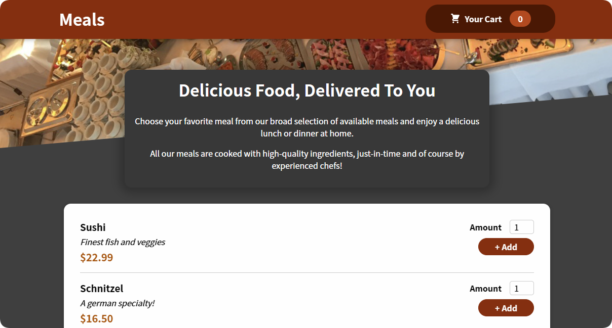

# Food Order App




> Aplicação front-end para visualizar itens e adicionar produtos num carrinho em um restaurante.

## 💻 Pré-requisitos

-   Você instalou a versão mais recente do Node.js

## 🚀 Instalando Food Order App

Para instalar o Food Order App, abra um terminal na pasta raiz do projeto e digite o seguinte comando:

```
npm install
```

## ☕ Usando Food Order App

Para usar Food Order App, abra um terminal na pasta raiz do projeto e digite o seguinte comando:

```
npm start
```
